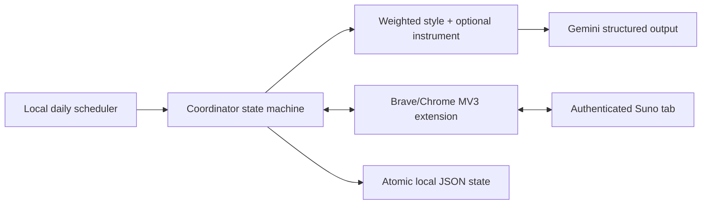

# Architecture

## System shape

The split is intentional: secrets and orchestration stay in Node; cookies stay inside the browser profile; the content script knows only the prepared Suno fields.

## Daily run

1. Cron creates one run for the current day in the configured timezone.
2. Extension leases an `inspect` command, opens or reuses an exact `https://suno.com/create` tab, and reports `available`, `upgrade`, or `unknown`. Other Suno tabs are left untouched. A positive remaining-credit count means available; only an explicit zero/exhaustion message means upgrade. Enabled or disabled composer actions, `Free Plan`, `Earn Credits`, and promotional `Upgrade to Pro` links are inconclusive and remain unknown.
3. `upgrade` completes without work. `observe` records what was observable and stops without claiming availability. An initial `unknown` does not block draft preparation because no quota-consuming action has occurred. After a live click, `unknown` stops the run to prevent another ambiguous click.
4. `draft` or `live` selects one enabled style by weight. An independent probability decides whether to select a weighted feature instrument.
5. Gemini returns `{title, lyricsField}` under JSON Schema; Zod validates bracket-only structure.
6. Extension activates Custom mode, fills title/structure/style, and enables Instrumental.
7. `draft` stops. In `live`, the adapter locates `button[aria-label="Create song"]` first, with a text-based semantic fallback. It checks local form readiness only after filling the fields and clicks only when the extension's separate local safety gate is enabled and the action is enabled.
8. A `submitted` browser result means the guarded click was dispatched, not that Suno's server accepted generation. Quota is inspected again; observable server-driven Suno state remains authoritative. If that result is still unknown, the run stops rather than dispatching another click.

Commands are leased and state/result transitions are atomic and idempotent. State writes use a temporary file plus atomic rename. Live browser dispatch is at-most-once: a lost response is never retried because the click outcome is ambiguous. Interrupted planning is safely re-inspected; an ambiguous creation is stopped for manual reconciliation. The daily guard counts submitted plus pending live generation slots, not songs; each Suno generation may produce two versions.

## Weighted presets

Weights are relative, not ranks. For enabled items:

`P(item) = item.weight / sum(all enabled positive weights)`

Equal values give equal probability. Zero disables selection without deleting the preset. New styles and instruments are plain YAML entries; IDs remain stable kebab-case audit identifiers.

## Modes

| Mode      | Inspect | Call Gemini | Fill Suno | Click Create               |
| --------- | ------- | ----------- | --------- | -------------------------- |
| `observe` | yes     | no          | no        | no                         |
| `draft`   | yes     | yes         | yes       | never                      |
| `live`    | yes     | yes         | yes       | only with extension opt-in |

## Known boundary

Suno has no supported integration in this project. DOM labels can change. Semantic selector fallbacks are covered against simulated DOM, and the current composer has only been inspected read-only. First real validation must remain in `observe`, then `draft`, before live is enabled.
